# **NOOSE NAUGHT** (a hangman game)

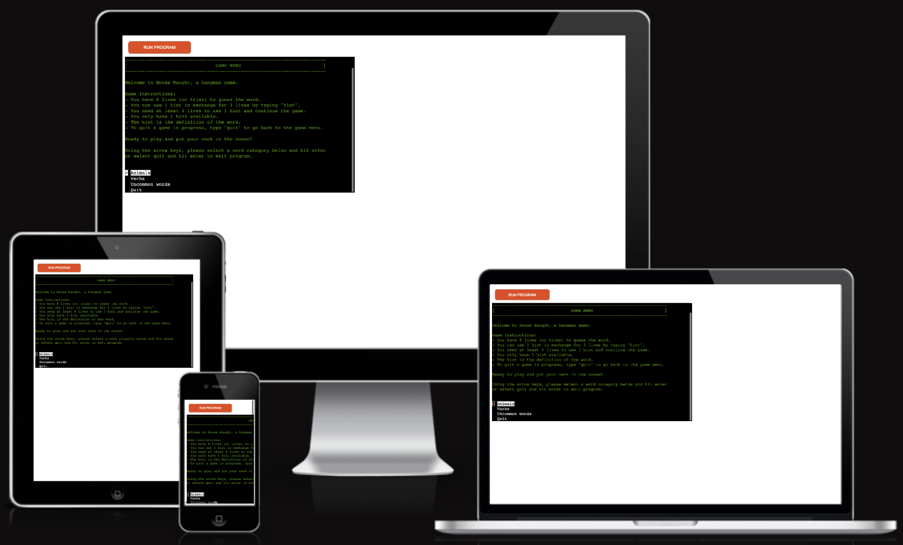

*The link to [Noose Naught](https://pp3-noose-naught-06bebcccec81.herokuapp.com/)*

Noose Naught is a Python terminal project and its purpose is to provide entertainment via a game of hangman. To those unfamiliar of the concept, hangman is a game whereby players guess a word with limited tries, otherwise it's game over and the man is hanged, hence the name.

---

## HOW TO PLAY:

1. Click this *[link](https://pp3-noose-naught-06bebcccec81.herokuapp.com/)* or copy this: `https://pp3-noose-naught-06bebcccec81.herokuapp.com/` and paste it in your browser's address bar.
1. Normally, the program should automatically run once the page has loaded. If not, click on the 'RUN PROGRAM' button on top.
1. Read the game instructions on the game menu.
1. Using the arrow keys, select a word category and hit enter to start a game, or select quit and hit enter to exit the program.

---

## USER STORIES

### As a user:

- I want to immediately understand how the program works without difficulty through intuitive navigation and controls.
- I want to be able to select different word categories to try out different challenges.
- I want to be able to quit and close the program from the game menu.
- I want to be notified if I have entered a wrong input and be told what type of input is needed.
- I want to be able to use hint and get the definition of the word in question to help me guess it.
- I want to be able to quit a game in progress and go back to the game menu.
- I want to know how many lives I had left after I have guessed the word correctly.
- I want to know how many letters I guessed correctly, as well as what the word in question was, after I have run out of lives.

---

## FEATURES

### Game Menu

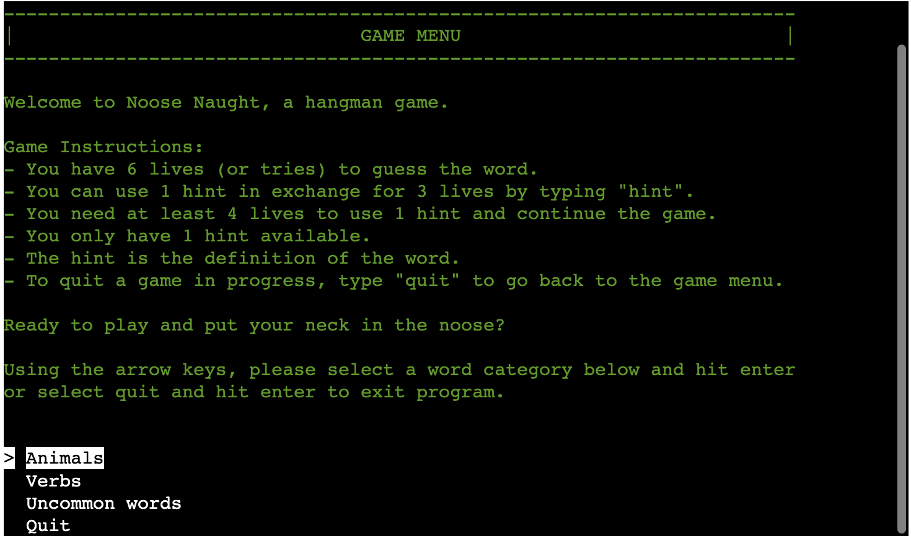

- It contains a welcome message.
- It provides the game instructions.
- It gives options for three different word categories, as well as the option to quit and close the program.

### Game in Progress Display

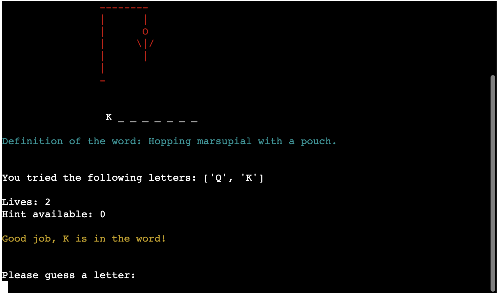

- It displays the hangman stage.
- It displays blanks corresponding to the number of letters to guess.
- It displays the definition of the word if the hint was used.
- It lists the letters already entered for the user's reference.
- It shows the number of lives and hint available.
- It provides feedback in yellow depending on the user's input.
- It prompts the user to guess a letter.

### Game Won Display

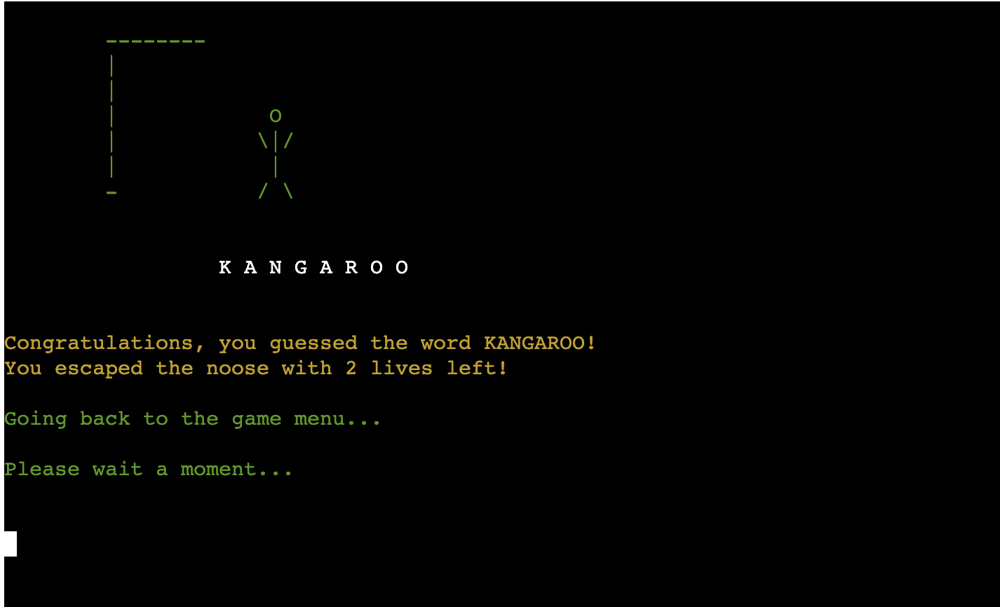

- It shows the man escaping the gallows.
- It shows a congratulatory message, as well as the number of lives left.
- It informs the user that the program is going back to the game menu and to wait a moment.

### Game Over Display

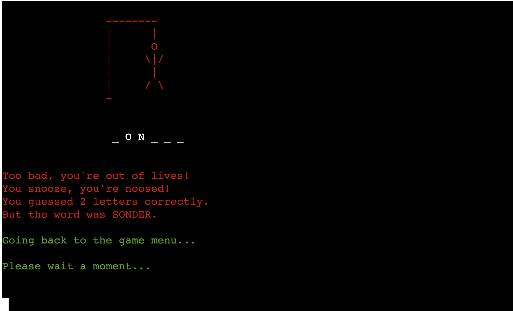

- It shows the man hanged.
- It shows a consolatory message, as well as the number of letters guessed correctly and the word in question.
- It informs the user that the program is going back to the game menu and to wait a moment.

---

## FLOWCHART

The flowchart below shows the logic of the application:

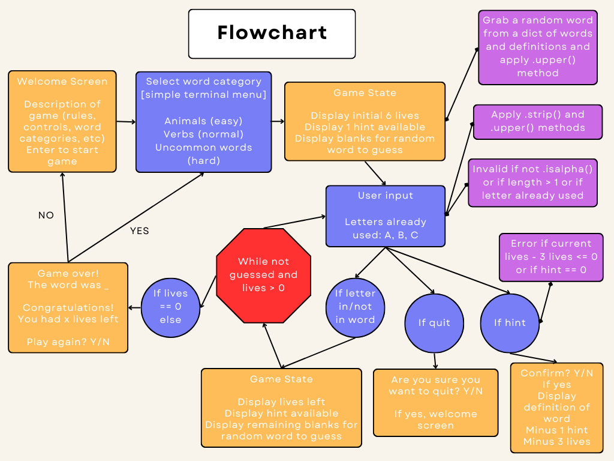

---

## TECHNOLOGIES USED

### Languages:

- [Python 3.9.1](https://www.python.org/downloads/release/python-391/): used to anchor the project and direct all application behaviour.
- [JavaScript](https://www.javascript.com/): used to provide the start script needed to run the Code Institute mock terminal in the browser.
- [HTML](https://developer.mozilla.org/en-US/docs/Web/HTML): used to construct the elements involved in building the mock terminal in the browser.

### Frameworks/Libraries, Programmes, and Tools:

#### Python modules/packages:

##### Standard library imports:

- [random](https://docs.python.org/3/library/random.html) was used to choose a random word from a list.
- [os](https://docs.python.org/3/library/os.html ) was used to clear the terminal at certain points of the logic flow of the application.
- [time](https://docs.python.org/3/library/time.html) was used to add a few seconds of time delay to give users time to read messages, as well as to give an illusion of loading.

##### Third-party imports:

- [Simple Terminal Menu](https://pypi.org/project/simple-term-menu/) was used to implement the game menu when choosing word categories and when confirming to use hint or when quitting.
- [Colorama](https://pypi.org/project/colorama/) was used to add colours to some text.

#### Other tools:

- [VSCode](https://code.visualstudio.com/) was used as the main tool to write and edit code.
- [Git](https://git-scm.com/) was used for the version control of the website.
- [GitHub](https://github.com/) was used to host the code of the website.
- [Canva](https://www.canva.com/) was used to create the flowchart for the application.
- [Code Institute's CI Python Linter](https://pep8ci.herokuapp.com/) was used to validate the PY files.
- [Heroku](https://www.heroku.com/) was used to deploy the project.

---

## TESTING

Tests done are documented in the [TESTING.md](TESTING.md) file.

---

## DEPLOYMENT

- The program was deployed to [Heroku](https://www.heroku.com/)
- Access the program at this [link](https://pp3-noose-naught-06bebcccec81.herokuapp.com/)

### To deploy the project as an application that can be **run locally**:

*Note:*
  1. This project requires you to have Python installed on your local PC:
  - `sudo apt install python3`

  1. You will also need pip installed to allow the installation of modules the application uses.
  - `sudo apt install python3-pip`

Create a local copy of the GitHub repository by following one of the two processes below:

- Download ZIP file:
  1. Go to the [GitHub Repo page](https://github.com/marcgithub23/pp3-noose-naught).
  1. Click the Code button and download the ZIP file containing the project.
  1. Extract the ZIP file to a location on your PC.

- Clone the repository:
  1. Open a folder on your computer with the terminal.
  1. Run the following command
  - `git clone https://github.com/marcgithub23/pp3-noose-naught.git`

- Alternatively, if using Gitpod, you can click below to create your own workspace using this repository.

  

  1. Install Python module dependencies:

      1. Navigate to the folder pp3-noose-naught by executing the command:
        - `cd pp3-noose-naught`
      1. Run the command pip install -r requirements.txt
        - `pip3 install -r requirements.txt`

### To deploy the project to Heroku so it can be run as a remote web application:

- Clone the repository:
    1. Open a folder on your computer with the terminal.

    1. Run the following command
    - `git clone https://github.com/marcgithub23/pp3-noose-naught.git`

    1. Create your own GitHub repository to host the code.

    1. Run the command `git remote set-url origin <Your GitHub Repo Path>` to set the remote repository location to your repository.

    1. Push the files to your repository with the following command:
    `git push`

    1. Create a Heroku account if you don't already have one here [Heroku](https://dashboard.heroku.com).

    1. Create a new Heroku application on the following page here [New Heroku App](https://dashboard.heroku.com/apps):
    - 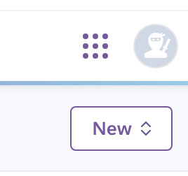

    1. Go to the Deploy tab:
        - 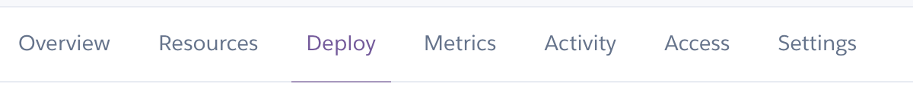
        - 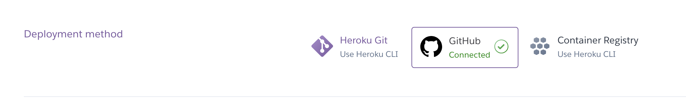

    1. Link your GitHub account and connect the application to the repository you created.
        - 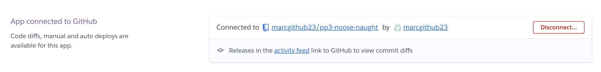

    1. Go to the Settings tab:
        - 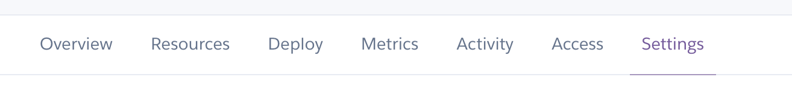

    1. Click "Add buildpack" and add the Python and Node.js buildpacks in the following order:
        - 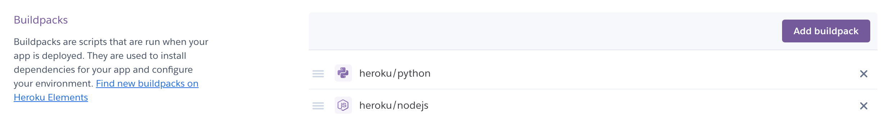
    
    1. Click "Reveal Config Vars"
        - 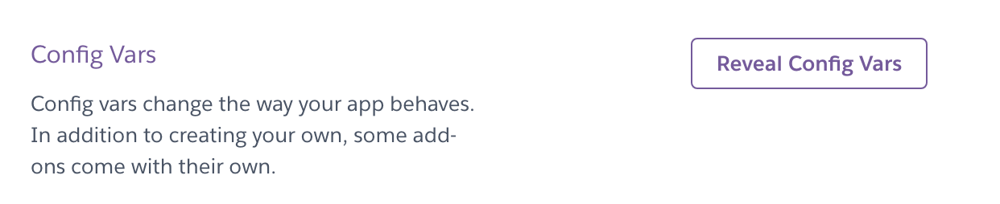
    
    1. Add 1 new Config Vars:
        - Key: PORT Value: 8000
        - *This Config was provided by [CODE INSTITUTE](https://codeinstitute.net/)*.
    
    1. Go back to the Deploy tab:
        - 
    
    1. Click "Deploy Branch":
        - 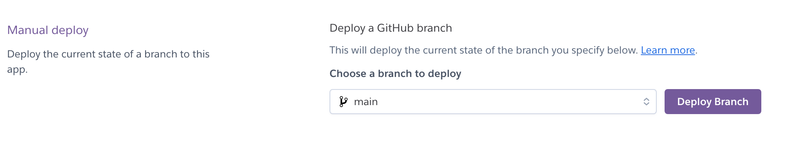
        - Wait for the completion of the deployment.
        - 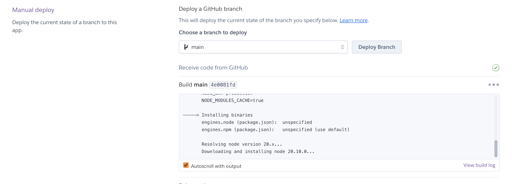
    
    1. Click "View" to launch the application inside a web page.
        - 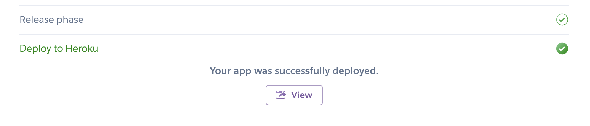

---

## CREDITS

### Coding

- The following YouTube tutorials were consulted whose codes were adapted to my use case:
    - [How to build HANGMAN with Python in 10 MINUTES](https://www.youtube.com/watch?v=m4nEnsavl6w&list=WL&index=4) by [Kite](https://www.youtube.com/@KiteHQ)
    - [Beginners Python Project | Hangman Tutorial](https://www.youtube.com/watch?v=z9t2rdTL-6M&list=WL&index=5) by [Scottish Coder](https://www.youtube.com/@scottishcoder281)
- The following YouTube tutorials inspired the menu design and logic of this project:
    - [Simple menus in python](https://www.youtube.com/watch?v=Zpa-rc9e388) by [Chad Thackray](https://www.youtube.com/@ChadThackray)
    - [Make Menus In Python with While True Loop](https://www.youtube.com/watch?v=ZBx7oWCJ4aY&list=WL&index=8&t=618s) by [Fabio Musanni](https://www.youtube.com/@FabioMusanni)
- This [blog article](https://bobbyhadz.com/blog/python-get-random-key-value-from-dictionary#get-a-random-key-from-a-dictionary-in-python) was consulted for how to choose a random key from a dictionary.
- The YouTube tutorial [How To Print Colored Text in Python (Colorama Tutorial)](https://www.youtube.com/watch?v=u51Zjlnui4Y) by [Tech With Tim](https://www.youtube.com/@TechWithTim) was consulted for how to implement colorama to change text colour in the terminal.

### Text content

- Words and definitions were adapted from Google dictionary, which is provided by [Oxford Languages](https://languages.oup.com/google-dictionary-en/).

---

## ACKNOWLEDGEMENTS

I am indebted to [Juliia Konovalova](https://github.com/IuliiaKonovalova), my mentor, for her insightful guidance and advice throughout this project. Thank you.