# TESTING

The program was tested constantly during its development process.
Volunteer testers have also tested it to detect and report any possible issues in the logic flow of the application.

## MANUAL TESTING

### Game Menu

| Feature | Action | Expected Result | Tested | Passed | Comments |
| --- | --- | --- | --- | --- | --- |
| Word categories options | Press up and down arrow keys and hit enter | Choose a random word from the selected word category and start game | Yes | Yes | None |
| Quit option | Hit enter | Thank you message and exits the program | Yes | Yes | Error message is shown when an invalid option or action has been done |

### Game in Progress Display

| Feature | Action | Expected Result | Tested | Passed | Comments |
| --- | --- | --- | --- | --- | --- |
| Hangman visuals | Guess a letter | Visuals update if guess is wrong | Yes | Yes | None |
| Blanks | Guess a letter | Blanks are replaced with the correct letter guessed | Yes | Yes | None |
| Tried letters | Guess a letter | List updates with the letter just gussed by user | Yes | Yes | None |
| Lives counter | Guess a letter | Minus 1 life if guess is wrong | Yes | Yes | None |
| Hint counter | Type "hint" and hit enter | Minus 1 hint and displays definition of word if hint is used | Yes | Yes | A confirmation message asks user if they want to use hint. Options are between yes and no, and an error message is shown when an invalid option or action has been done |
| Feedback message | Guess a letter | Corresponding message is shown according to the user's input | Yes | Yes | None |
| User input | Guess a letter | Input validation is applied | Yes | Yes | None |
| Quit option | Type "quit" and hit enter | Thanks for the attempt and goes back to game menu | Yes | Yes | A confirmation message asks user if they want to quit to game menu. Options are between yes and no, and an error message is shown when an invalid option or action has been done |

### Game Won Display

| Feature | Action | Expected Result | Tested | Passed | Comments |
| --- | --- | --- | --- | --- | --- |
| Hangman visuals | Win game | Visuals update to show man escaping the gallows | Yes | Yes | None |
| Message | Win game | Message congratulates user and provides number of lives left | Yes | Yes | None |
| Back to game menu | Win game | Message informs user to wait a moment while program goes back to game menu | Yes | Yes | None |

### Game Over Display

| Feature | Action | Expected Result | Tested | Passed | Comments |
| --- | --- | --- | --- | --- | --- |
| Hangman visuals | Lose game | Visuals update to show the man is hanged | Yes | Yes | None |
| Message | Lose game | Message consoles user and provides number of correct letters guessed and the word in question | Yes | Yes | None |
| Back to game menu | Lose game | Message informs user to wait a moment while program goes back to game menu | Yes | Yes | None |

---

## USER STORY TESTING

| User Story | Requirement Met | Image |
| --- | --- | --- |
| I want to immediately understand how the program works without difficulty through intuitive navigation and controls. | Yes | 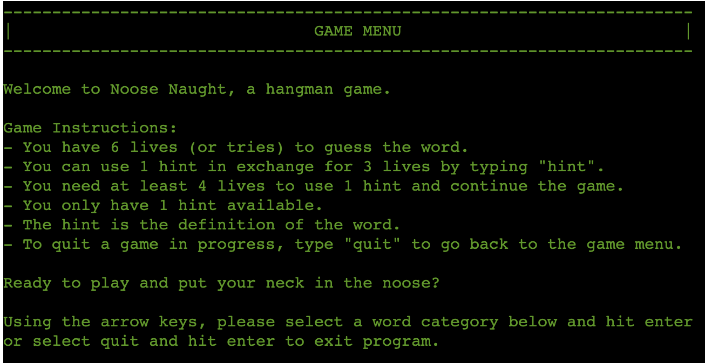 |
| I want to be able to select different word categories to try out different challenges. | Yes | 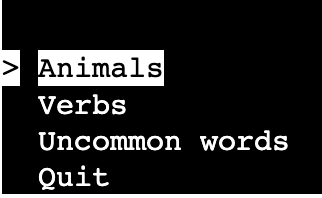 |
| I want to be able to quit and close the program from the game menu. | Yes | Please refer to the image above |
| I want to be notified if I have entered a wrong input and be told what type of input is needed. | Yes | 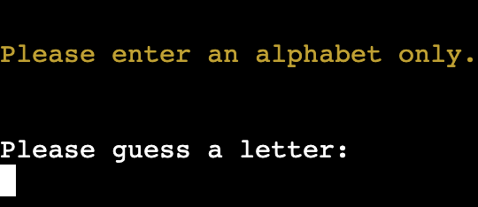 |
| I want to be able to use hint and get the definition of the word in question to help me guess it. | Yes | 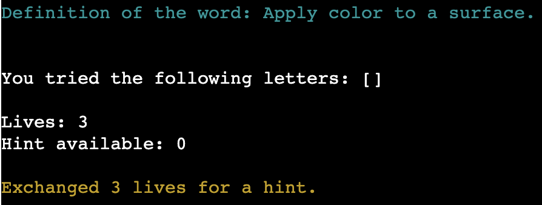 |
| I want to be able to quit a game in progress and go back to the game menu. | Yes | 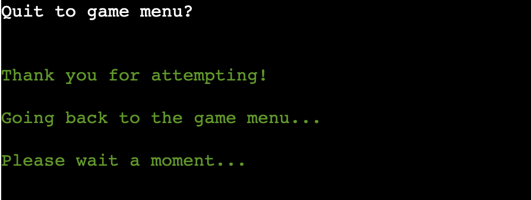 |
| I want to know how many lives I had left after I have guessed the word correctly. | Yes | 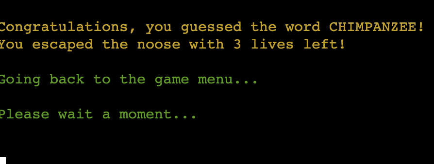 |
| I want to know how many letters I guessed correctly, as well as what the word in question was, after I have run out of lives. | Yes | 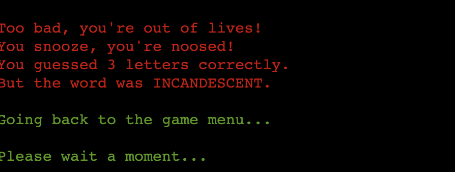 |

## VALIDATOR TESTING

### Python

No errors or warnings were found when passing through Code Institute's [CI Python Linter](https://pep8ci.herokuapp.com/), and therefore [Pep 8-compliant](https://legacy.python.org/dev/peps/pep-0008/)

- **run.py**

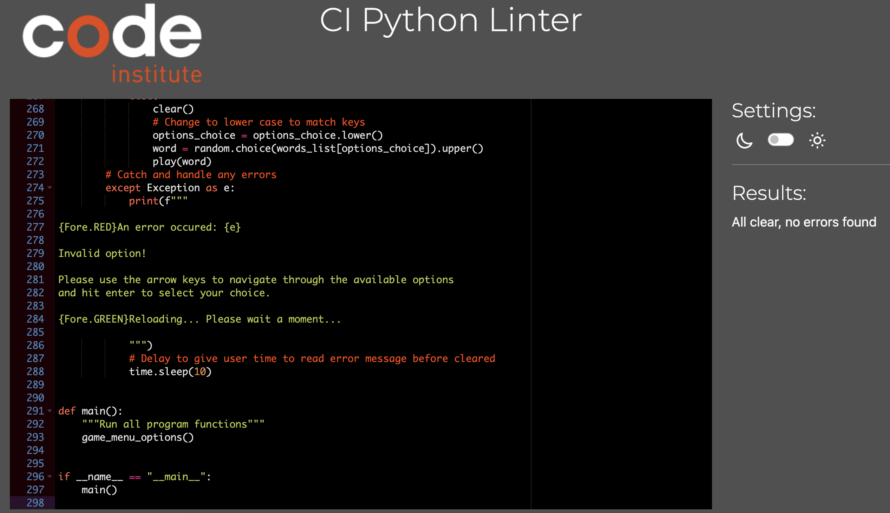

- **hangman_visuals.py**

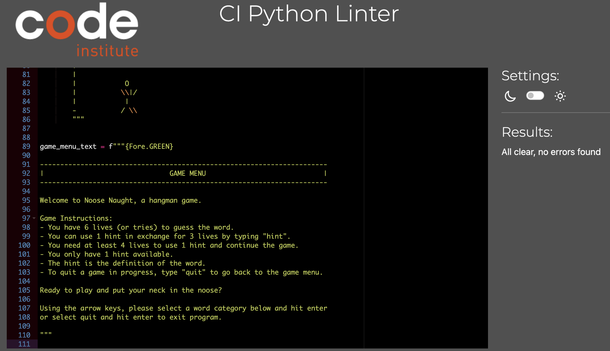

- **words.py**

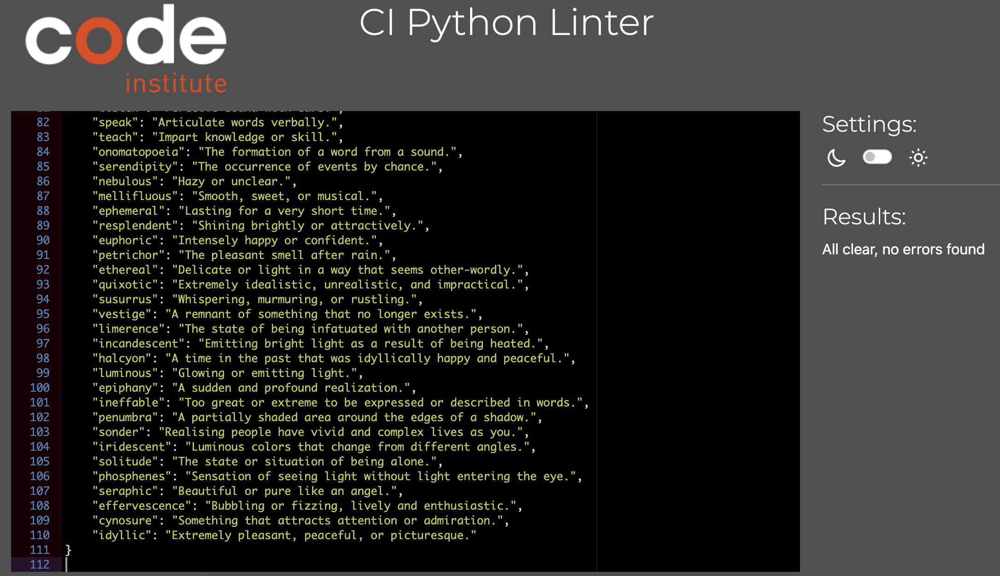

---

## ISSUES WITH VALIDATING THE CODE

The validator flags an error if an empty line is missing at the very end of the codebase. GitHub does not show the last empty line in all py files. However, please refer to the screenshots above to double check that an empty line is indeed present at the very end of the codebase in each py file.

---

## BUGS OR ISSUES

### Solved bugs or issues:

- KeyError when accessing corresponding definition of the word randomly chosen.
    - 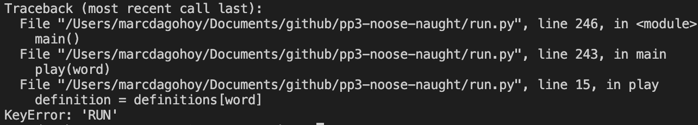
    - Fix: changed randomly selected word to lower case using .lower() method.
- TypeError when pressing Q or Esc when simple term menu options are shown.
    - 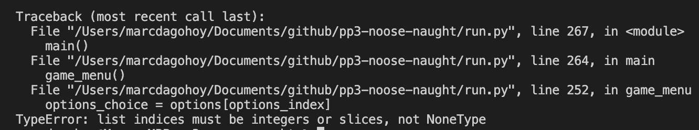
    - Fix: Error handling using try and except
- The feedback message "Please enter one letter only" does not make sense when user does not type any letter and presses enter.
    - Fix: in the input validation block, changed the first if condition from len(guess) != 1 to len(guess) > 1 and added a new elif condition len(guess) == 0 to print a more appropriate feedback.
    - 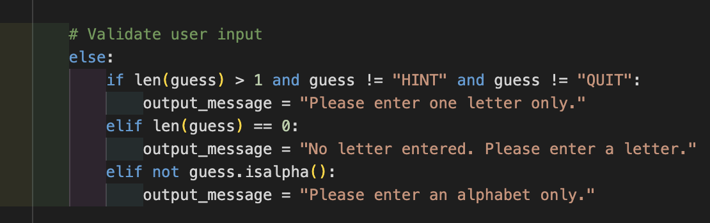
- Initial Python validation errors.
    - 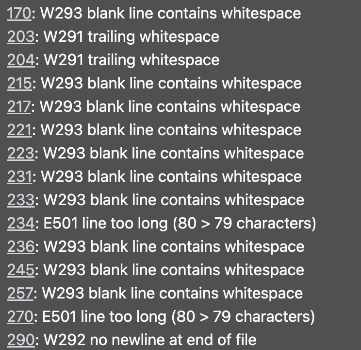
    - Fix: deleted trailing whitespaces, reformatted code so no lines are over 79 characters long, and added a new empty line at the end of the codebase.
- ModuleNotFoundError for colorama.
    - 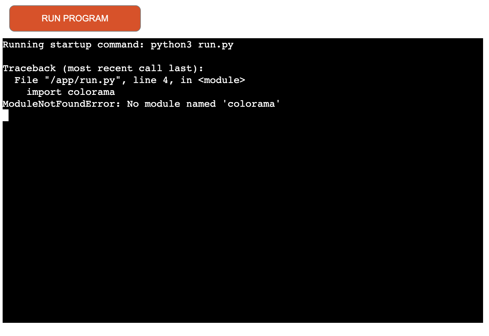
    - Fix: updated required dependencies by typing pip3 freeze > requirements.txt in the terminal and redeployed to Heroku.

### Unsolved bugs or issues:

- The clear function works fine and clears the terminal when running the program locally on VSCode on MacBook Pro. However, on the deployed version on Heroku, it does not work properly. Instead of clearing the mock terminal completely, it leaves a few bits and pieces above. It has been tested on Linux and it seems like the mock terminal is cleared fine on Heroku.
    - 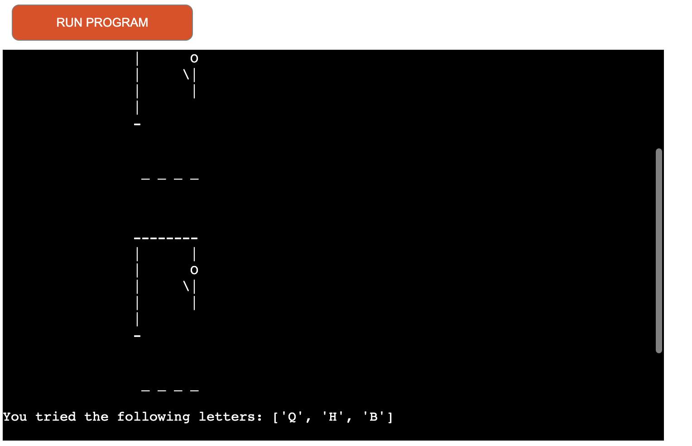
    - 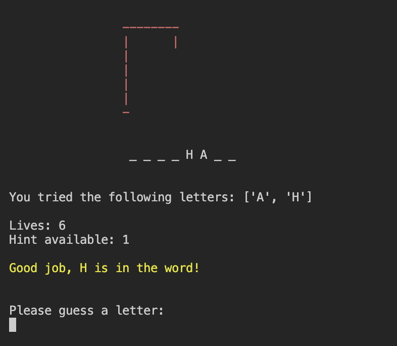
    - 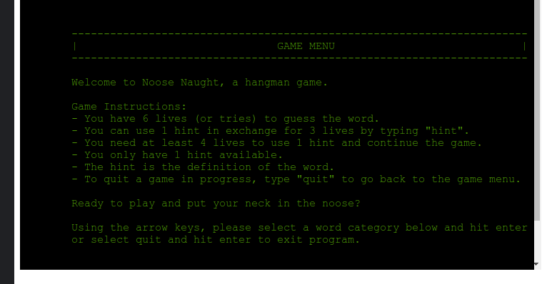
    - Fix attempts:
        - Redefined the clear function to just have 'clear' and excluding 'cls'. This did not fix the problem, so the code was reverted back.
        - Searched the appropriate Slack channel and it seems like a few people encountered the same issue in the past, but none of them appear to have been fully resolved. Made a new post to ask for help but no reply received by the time of submission of this project.
    - As this issue only shows up on Heroku (and works perfectly fine otherwise), it has remained unsolved and perhaps the issue may root from the way the mock terminal on Heroku is set up.